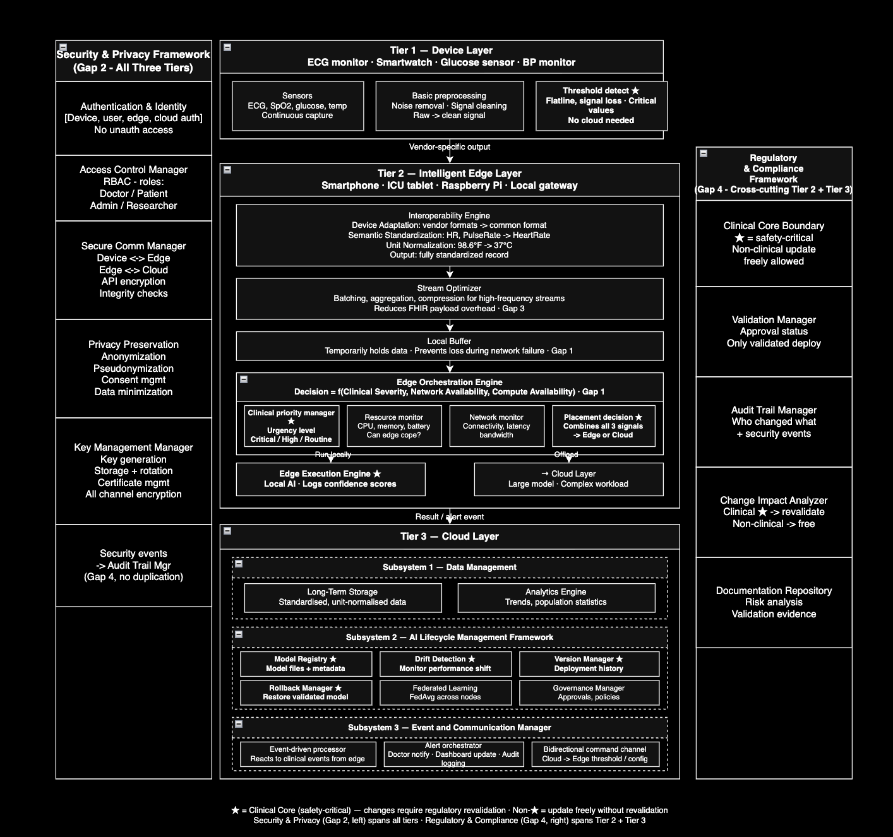

# SaMD Reference Architecture Prototype

A generic, modular reference architecture for **Software as a Medical Device (SaMD)** systems, addressing 6 critical architectural gaps identified through a systematic literature review — implemented as a full-stack working prototype.

> Research internship project — IIT Indore

---

## 🎯 Problem

Existing SaMD systems suffer from fragmented edge-cloud architectures, vendor lock-in, poor interoperability, lack of AI lifecycle management, regulatory bottlenecks, and limited security frameworks. This project proposes and implements a unified architecture solving all of these.

## 🏗️ Architecture Overview



The architecture follows a **three-tier model** (Device → Edge → Cloud) with two **cross-cutting frameworks** spanning all tiers:
Tier 1 — Device Layer

Sensors → Preprocessing → Threshold Detection
Tier 2 — Intelligent Edge Layer

Interoperability Engine → Stream Optimizer → Local Buffer

→ Edge Orchestration Engine (Clinical Priority, Resource,

Network Monitors + Placement Decision Engine)

→ Edge Execution Engine
Tier 3 — Cloud Layer

Data Management (Storage + Analytics)

AI Lifecycle Management (Registry, Drift Detection,

Version Manager, Rollback, Federated Learning, Governance)

Event & Communication Manager
Cross-Cutting:

Security & Privacy Framework (all tiers)

Regulatory & Compliance Framework (Tier 2 + 3)

## 🔍 Six Architectural Gaps Addressed

| Gap | Problem | Solution |
|---|---|---|
| **1. Edge-Cloud Orchestration** | No standard mechanism deciding where computation runs | Context-aware Orchestration Engine using clinical severity, network, and resource availability |
| **2. Security & Privacy** | Distributed edge AI introduces inconsistent security | Cross-cutting Security Framework — auth, RBAC, encryption, privacy preservation, key management |
| **3. Interoperability** | Vendor-specific formats, FHIR inefficient for streaming | Interoperability Engine (device adaptation, semantic mapping, unit normalization) + Stream Optimizer |
| **4. Regulatory Compliance** | Monolithic systems require full revalidation for any change | Clinical Core Boundary separates safety-critical vs non-clinical components |
| **5. AI Lifecycle Management** | No drift detection, versioning, or safe rollback | Full lifecycle framework with automated drift detection and rollback |
| **6. Telemetry & Communication** | No event coordination or bidirectional communication | Event-driven processor + Alert orchestrator + Bidirectional command channel |

## ⚙️ Tech Stack

**Backend:** Python · FastAPI · WebSockets · SQLite · psutil
**Frontend:** React · WebSocket client
**Architecture diagrams:** SVG

### Backend
- **Python 3.14** — core language for all architecture modules
- **FastAPI** — REST API + WebSocket server
- **Uvicorn** — ASGI server running FastAPI
- **WebSockets** — real-time bidirectional streaming of pipeline events to frontend
- **SQLite** — lightweight embedded database (readings, audit trail, model registry, confidence logs)
- **psutil** — real-time system metrics (CPU %, RAM %, battery) for the Resource Monitor
- **subprocess (ping)** — real network connectivity and latency checks for the Network Monitor
- **NumPy-style averaging** — manual FedAvg implementation for federated learning simulation

### Frontend
- **React** (Create React App) — single-page live dashboard
- **WebSocket API (native browser)** — receives live pipeline events from backend
- **Inline CSS-in-JS** — dark-themed dashboard styling, no external UI library

### Architecture & Design
- **SVG** — all architecture diagrams (tier structure, cross-cutting frameworks)
- **Modular Python design** — every architecture component implemented as an independent, testable module with a standard input/output interface

### Tooling
- **Git & GitHub** — version control
- **VS Code** — development environment
- **pip** — Python package management
- **npm** — JavaScript package management

## ✨ Key Features

- **Real-time orchestration** — reads actual CPU, RAM, and network latency to decide edge vs cloud routing live
- **Automated drift detection** — monitors AI model confidence over time and triggers automatic rollback when performance degrades
- **Simulated federated learning** — FedAvg aggregation across 3 simulated hospital nodes without sharing raw patient data
- **Live dashboard** — WebSocket-powered visualization showing every pipeline step in real time
- **Full audit trail** — every action logged, classified as clinical-core or non-clinical for regulatory compliance

## 🚀 Running Locally

### Backend
```bash
pip3 install fastapi uvicorn websockets psutil
uvicorn api:app --reload
```
Server runs at `http://localhost:8000`

### Frontend
```bash
cd frontend
npm install
npm start
```
Dashboard runs at `http://localhost:3000`

## 📂 Project Structure
├── tier1_device/        # Sensors, preprocessing, threshold detection

├── tier2_edge/           # Interoperability, orchestration, edge execution

│   └── orchestration/    # Clinical priority, resource/network monitors

├── tier3_cloud/          # Storage, analytics, AI lifecycle, events

├── frontend/             # React live dashboard

├── api.py                # FastAPI server + WebSocket

├── config.py              # Central configuration

└── main.py                # CLI pipeline runner

## 📊 Demo Highlights

- Toggle WiFi off → orchestration automatically routes to edge
- Stress CPU → orchestration automatically routes to cloud
- Approve/deploy models live through the dashboard
- Watch automatic rollback when drift is simulated

---

*Built as part of a research internship — combining literature-driven architectural design with full-stack implementation.*
